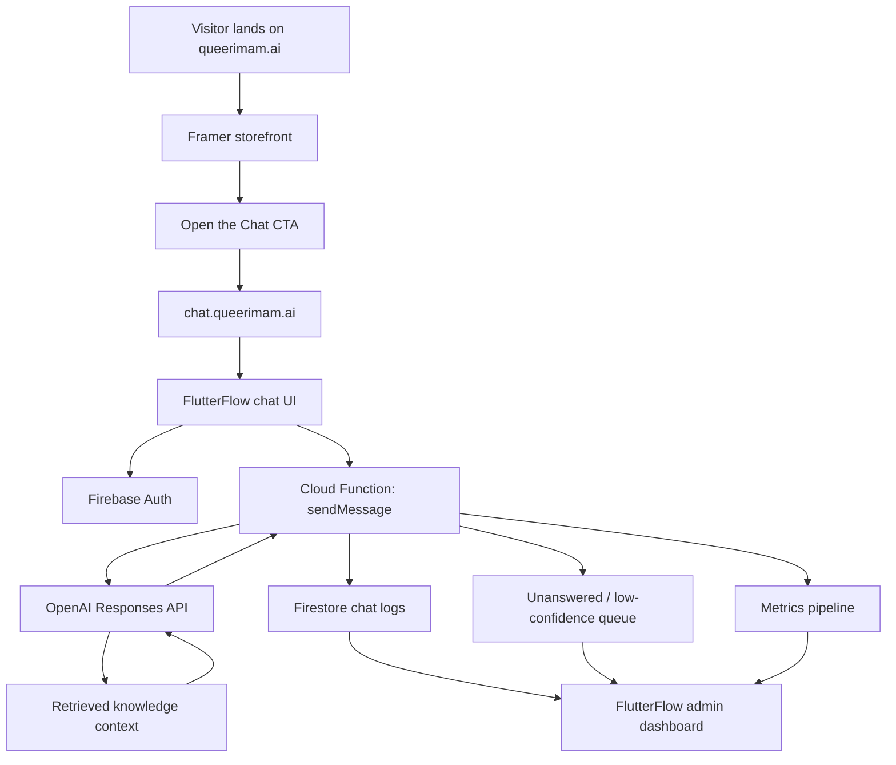

# Architecture Overview

This document explains the **public architecture** behind queerimam.ai in a way that is technically legible without exposing sensitive implementation details.

## 1. High-level system

At MVP level, queerimam.ai uses a hybrid architecture:

- **Framer** for the public storefront and conversion pages
- **FlutterFlow** for the responsive chat UI and admin panel
- **Firebase** for hosting, auth, Firestore, Storage, and Cloud Functions
- **OpenAI** for generation and retrieval-backed answering
- **Operational review flows** for unanswered questions, prompt tuning, and KB iteration

## 2. Domain split

### Main domain
`queerimam.ai`

Used for:
- product narrative
- credibility and trust signals
- FAQs and safety framing
- newsletter capture
- donation / monetization entry points
- SEO and discoverability

### Chat subdomain
`chat.queerimam.ai`

Used for:
- the live assistant
- session handling
- anonymous or lightweight authenticated usage
- admin workflows and internal review views

This separation keeps the storefront and the application runtime logically distinct.

## 3. Frontend layers

### 3.1 Framer storefront

Framer is used as the marketing and trust layer.

Core sections:
- hero
- social proof
- FAQ
- safety and values
- newsletter capture
- donate / support flows
- primary CTA into chat

Reasons this layer matters:
- it gives the product a credible public face
- it centralizes messaging and conversion
- it avoids forcing the chat interface to carry all the burden of explanation

### 3.2 FlutterFlow application

FlutterFlow is used to rapidly ship:
- public chat UI
- responsive web experience
- lightweight auth patterns
- message send / receive flows
- admin dashboard views

Key app surfaces:
- **Chat page** — the user-facing assistant experience
- **Admin page** — a builder-facing interface for review and iteration

Admin capabilities in the MVP plan:
- review unanswered questions
- edit or approve KB material
- inspect metrics
- adjust prompt/system behavior

## 4. Backend layers

### 4.1 Firebase

Firebase acts as the application backbone.

### Firestore
Used for:
- chat logs
- question / answer records
- user-level counters
- unresolved or low-confidence items
- light product analytics
- admin-facing metrics snapshots

### Cloud Functions
Used for:
- model request orchestration
- retrieval orchestration
- logging
- nightly metrics aggregation
- document embedding jobs

Important design principle:
the client should **not** hold privileged model secrets or directly perform protected backend operations.

### Firebase Hosting
Used to serve the chat application.

### Firebase Storage
Used for:
- knowledge-base source files
- derived assets
- upload pipelines for admin content operations

### 4.2 OpenAI model layer

The model is called through a backend-controlled request.

The backend is responsible for:
- injecting the system prompt
- attaching retrieval tools or retrieval context
- setting output constraints
- logging request outcomes
- optionally flagging low-confidence cases for review

In public terms, the model layer is not just “answer a question.”
It is responsible for enforcing:
- tone
- theological method
- ambiguity handling
- scripture citation style
- safety behavior
- formatting discipline

## 5. Retrieval design

The retrieval approach is intentionally structured.

### Canon-first logic
The assistant first attempts to ground itself in a canonical philosophy / method document before drawing on topic-specific content.

This is useful because it:
- stabilizes the voice
- preserves consistency across answers
- reduces drift across theological or ethical issues
- creates a repeatable design logic instead of ad hoc answering

### Topic-specific supporting materials
Once the canonical layer is established, the assistant can consult:
- FAQs
- scholar summaries
- issue-specific notes
- pastoral support guidance
- practical resource documents

### Low-confidence handling
If the retrieved material is weak or the system cannot confidently resolve the user request:
- the answer should remain modest
- the case can be routed to an unanswered queue
- the admin layer can use the case to improve the KB or prompt logic

## 6. Request lifecycle

A simplified end-to-end flow:

1. User opens the chat interface
2. Frontend captures the message
3. Message is sent to a Firebase function
4. Function authenticates the request context and reads any relevant user/session state
5. Function calls the model with:
   - public-safe system instructions
   - retrieval configuration
   - output constraints
6. Model returns a response
7. Backend stores the message, answer, and metadata
8. If needed, backend flags the case for admin review
9. Frontend renders the answer to the user
10. Metrics are aggregated for product improvement

## 7. Safety and trust layers

A product like queerimam.ai needs more than one safety layer.

### Layer 1: Prompt-level behavior rules
These govern:
- voice
- escalation thresholds
- scripture handling
- ambiguity handling
- output hygiene

### Layer 2: Retrieval constraints
These reduce freeform improvisation by grounding the system in curated material.

### Layer 3: Product UX boundaries
Examples:
- email capture only after some product value is shown
- donation nudges after engagement rather than on first contact
- human review paths for unresolved cases

### Layer 4: Admin oversight
The builder can inspect:
- unresolved questions
- recurring themes
- answer gaps
- performance and engagement trends

## 8. Metrics that matter

The MVP plan emphasizes a few concrete measures:

- activation rate
- latency
- unresolved-question rate
- helpfulness signals
- email capture rate
- donation click rate

These matter because they connect:
- trust
- usability
- answer quality
- sustainability

This is not only an LLM system. It is a product loop.

## 9. MVP metrics and operating signals

The original MVP plan emphasizes measurable product signals rather than vague intuition.

Core indicators include:
- activation rate above 20%
- latency below 5 seconds
- unresolved-question rate reduced from roughly 15% toward 8%
- helpfulness above 70%
- email capture above 5 to 10%
- donation-click rate in the low single digits

These metrics matter because they connect answer quality, user trust, and financial sustainability.

## 10. Public vs private boundaries

This document is intentionally public-safe.

It does **not** expose:
- production keys
- service-account credentials
- live project IDs that create risk
- exact proprietary KB contents
- user data schemas containing live values
- production review processes with sensitive context

The goal is transparency about the method, not exposure of the production environment.

## 11. Why this architecture is credible

This stack is credible because it is pragmatic.

It combines:
- fast product iteration
- manageable backend complexity
- a clear admin feedback loop
- safe separation between public UI and privileged operations
- a design that can scale from MVP to more mature operational workflows

In other words, queerimam.ai is architected not just to answer, but to **learn where it is weak, improve deliberately, and remain legible to the builder.**
